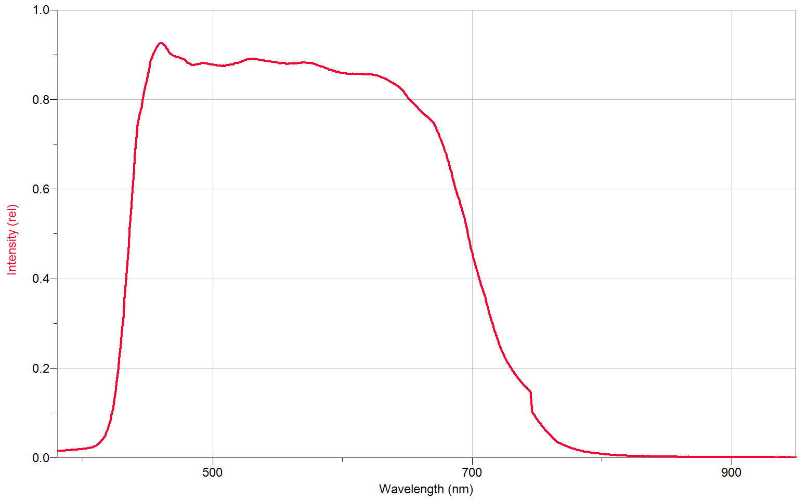
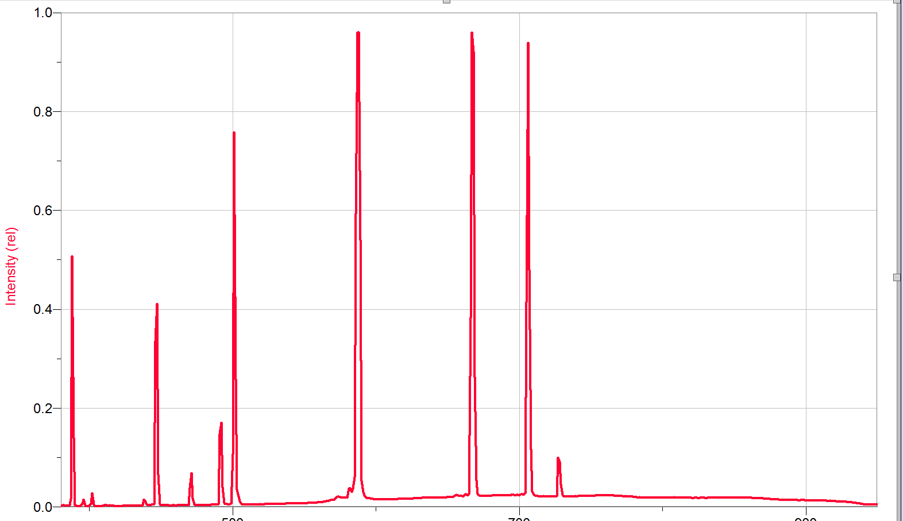
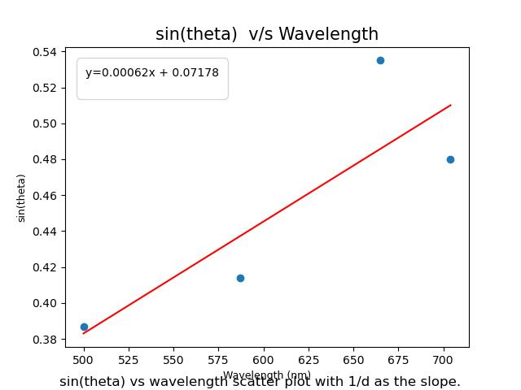

# Optical Spectroscopy and Diffraction Analysis

## Project Overview
This project investigates the wave nature of light through quantitative spectroscopy. Using both a commercial **Red Tide Spectrometer** and a custom **3D-printed spectrometer**, I analyzed the emission spectra of various light sources. A key objective was to experimentally determine the slit separation ($d$) of a diffraction grating by analyzing the interference pattern of Helium emission lines.

## Methodology
The experiment consisted of two distinct phases:

1.  **Digital Spectroscopy:** Utilized a commercial CCD-based spectrometer (Red Tide) to capture high-resolution emission spectra of Helium and white light sources.
2.  **Computer Vision Analysis:**
    * Captured spectral images using a custom 3D-printed spectrometer.
    * Developed a calibration pipeline to map pixel position to wavelength.
    * Measured the diffraction angles ($\theta$) of discrete spectral lines to calculate the grating constant.

## Mathematical Model
[cite_start]The diffraction pattern was analyzed using the grating equation[cite: 404]:

$$m \lambda = d \sin(\theta)$$

Where:
* $m$: Diffraction order ($m=1$ for the first maximum).
* $\lambda$: Wavelength of the spectral line.
* $d$: Spacing between grating slits.
* $\theta$: Diffraction angle.

By linearizing this equation ($\sin \theta$ vs. $\lambda$), the grating spacing $d$ was determined from the slope ($1/d$).

## Key Results
* [cite_start]**Grating Constant:** The experimental line density was calculated to be approximately **1355 lines/mm** based on the first-order maximum analysis[cite: 558].
* [cite_start]**Spectral Analysis:** Successfully identified discrete emission lines for Helium and continuous spectra for white LED sources[cite: 596].
* [cite_start]**Discrepancy:** A deviation from the manufacturer's specification (1000 lines/mm) was observed, attributed to resolution limits in the image capture process and camera parallax[cite: 588].

## Technologies Used
* **Analysis:** Python (Matplotlib for linear fitting), LoggerPro.
* **Hardware:** Red Tide Spectrometer, 3D-Printed Diffraction Grating, Fibre Optics.
* **Concepts:** Wave Optics, Quantum Emission, Linear Regression.

## Visualizations

### 1. 3D printed flashlight
*Discrete spectral lines corresponding to electron transitions in a 3D printed flashlight.*

### 2. Helium Emission Spectrum (Red Tide)
*Discrete spectral lines corresponding to electron transitions in Helium.*

### 3. Linear Regression of Diffraction Angles
*Linear fit of $\sin(\theta)$ vs. Wavelength ($\lambda$) used to determine slit spacing.*

