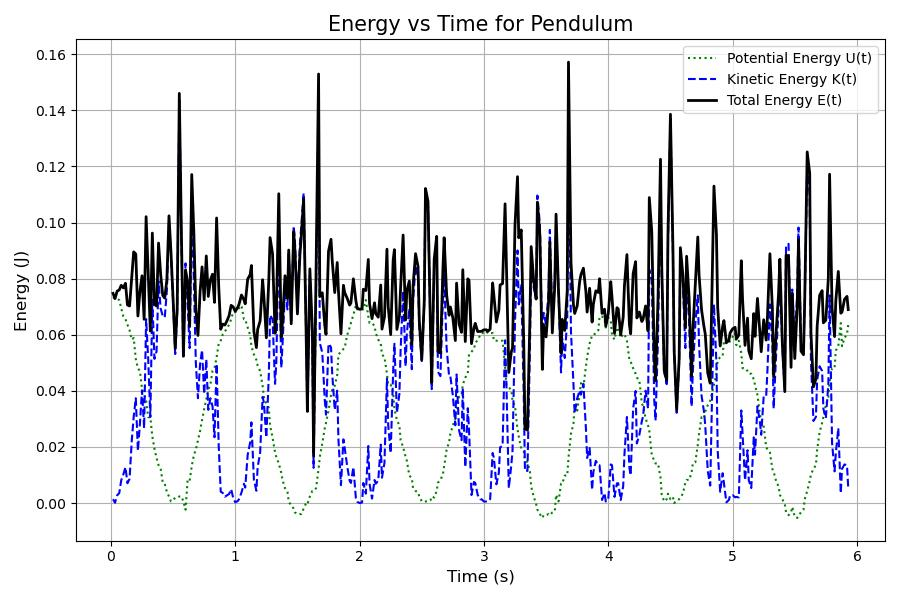
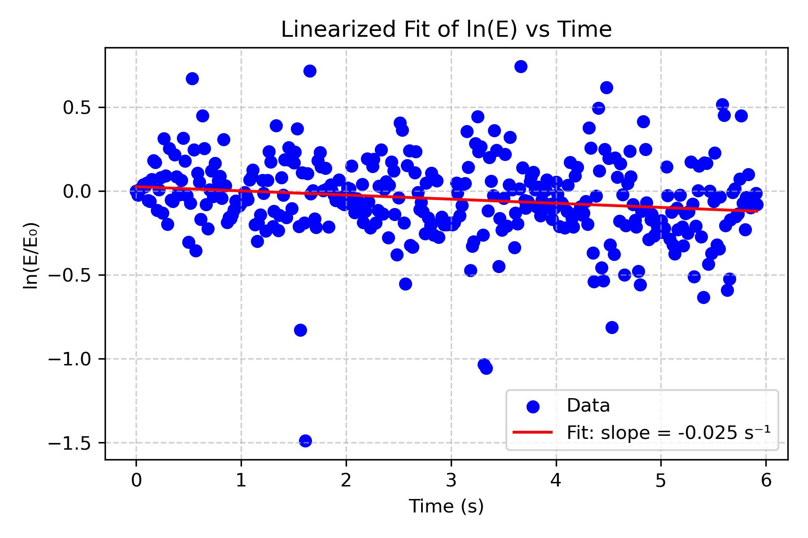

# Conservation of Energy and Damping Analysis

## Project Overview
This project investigates the conservation of mechanical energy in a pendulum system. By tracking the motion of a pendulum using computer vision, I analyzed the exchange between kinetic and potential energy and modeled the system's energy dissipation (damping) due to non-conservative forces like air resistance.

## Methodology
The experiment employed video analysis and computational modeling to determine the system's damping time constant ($\tau$):

1.  **Motion Tracking:** Utilized **Tracker Video Analysis** to capture frame-by-frame position $(x, y)$ and velocity $(v_x, v_y)$ data.
2.  **Energy Calculation:** Computed Kinetic ($K$) and Potential ($U$) energy for each time step using Python.
3.  **Damping Model:** Fitted the decay of Total Mechanical Energy ($E$) to an exponential model to quantify energy loss.

## Mathematical Model
The total mechanical energy $E(t)$ was modeled as a sum of kinetic and potential components:
$$E = K + U = \frac{1}{2}mv^2 + mgy$$

Due to non-conservative forces (friction/drag), the total energy decays exponentially:
$$E(t) = E_i e^{-(t-t_i)/\tau}$$

To determine the time constant $\tau$, the equation was linearized for regression analysis:
$$\ln(E) = -\frac{1}{\tau}t + C$$

## Key Results
* **Energy Conservation:** The analysis confirmed that $K$ and $U$ oscillate out of phase, maintaining the conservation of mechanical energy principles.
* **Damping Time Constant ($\tau$):** Calculated as **40.5 s**, indicating a gradual energy decay.
* **Model Fit:** The exponential model achieved an $R^2$ of **0.98**, validating the theoretical prediction for small-amplitude damping.

## Technologies Used
* **Analysis:** Python (Pandas, NumPy, Scipy).
* **Visualization:** Matplotlib (for energy oscillation and decay plots).
* **Tools:** Tracker Video Analysis (Computer Vision).

## Visualizations

### 1. Energy Transformation
*Oscillation of Kinetic and Potential energy over time. Note the total energy (black line) slowly decaying.*

### 2. Linearized Damping Analysis
*Linearized fit of $\ln(E)$ vs Time. The slope corresponds to the damping rate.*
