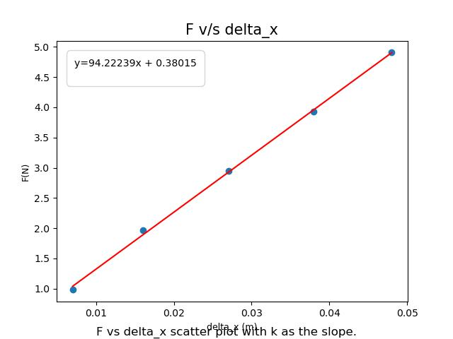
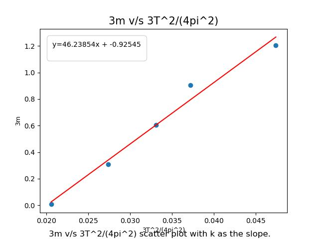

# Elastic Properties and Simple Harmonic Motion

## Project Overview
This project contrasts two experimental methods for determining the elastic properties of a non-ideal spring (rubber band). By applying **Hooke's Law** (Static Method) and **Simple Harmonic Motion** theory (Dynamic Method), I investigated the mechanical hysteresis and non-conservative behavior of polymer chains.

## Methodology
The study employed two distinct physical models to calculate the spring constant ($k$):

1.  **Static Analysis (Hooke's Law):**
    * Measured the static extension ($\Delta x$) of the system under varying loads ($F$).
    * Performed a linear regression on the $F$ vs. $\Delta x$ dataset to determine stiffness.
2.  **Dynamic Analysis (SHM):**
    * Measured the oscillation period ($T$) for varying effective masses.
    * Linearized the equations of motion to account for the effective mass of the spring ($m_s$).
    * Derived $k$ from the slope of the linearized oscillation data.

## Mathematical Models
### 1. Static Model
Based on Hooke's Law:
$$F = k \Delta x$$
* **Slope:** Spring Constant ($k$).

### 2. Dynamic Model (Linearized)
To account for the non-negligible mass of the spring, the period ($T$) is related to the mass ($m$) by:
$$3m = k \left( \frac{3T^2}{4\pi^2} \right) - m_s$$
* **Variable Y:** $3m$
* **Variable X:** $\frac{3T^2}{4\pi^2}$
* **Slope:** Spring Constant ($k$)
* **Intercept:** Negative effective mass ($-m_s$)

## Key Results
* **Static Spring Constant:** $94.2 \pm 1.8$ N/m
* **Dynamic Spring Constant:** $46.2 \pm 3.7$ N/m
* **Discrepancy Analysis:** The significant difference ($\approx 50\%$) indicates that the rubber band violates the Ideal Spring approximation. This is attributed to **hysteresis** and **entropy elasticity** in the polymer chains, which act as non-conservative forces during oscillation.

## Technologies Used
* **Analysis:** Python (NumPy, Matplotlib for linear regression).
* **Physics:** Classical Mechanics, Error Propagation, Polymer Physics.

## Visualizations

### 1. Static Loading Analysis
*Linear fit of Force vs. Extension. The steep slope indicates high static stiffness.*

### 2. Dynamic Oscillation Analysis
*Linearization of the Period-Mass relationship. The lower slope suggests dynamic softening due to damping.*
