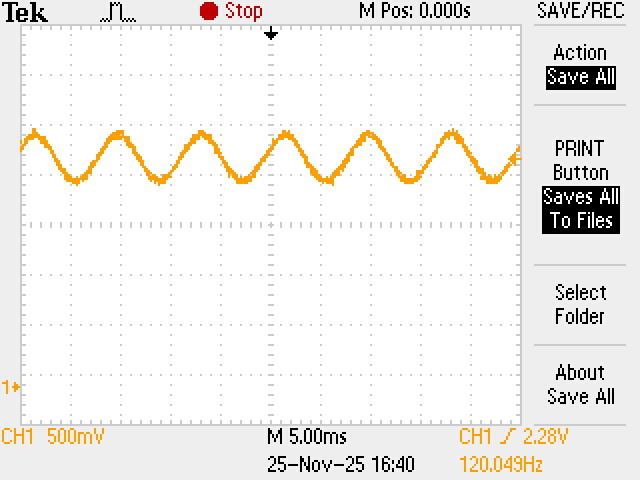
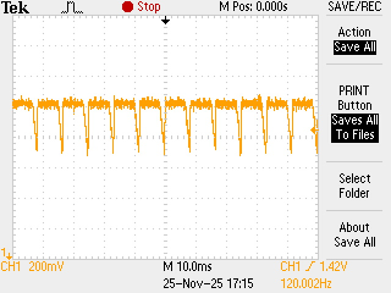
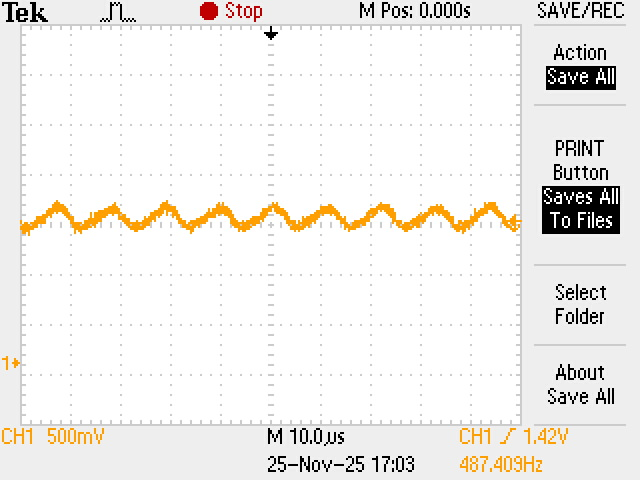

# Signal Acquisition & Instrumentation: Optical Waveform Analysis

## Project Overview
This project focuses on the hardware-level analysis of AC-driven optical systems. Using a digital storage oscilloscope and high-speed photodiodes, I characterized the temporal modulation of various light sources (Incandescent, CFL, LED) to investigate signal rectification, frequency doubling, and thermal inertia effects in commercial electronics.

## Instrumentation & Hardware Skills
* **Data Acquisition:** Configured **Tektronix Digital Oscilloscopes** for signal capture, utilizing advanced triggering and time-base scaling to stabilize high-frequency waveforms.
* **Transducers:** Implemented photodiode circuits to transduce optical intensity into measurable voltage signals.
* **Signal Analysis:** Interpreted AC waveforms to identify DC offsets, ripple factors, and harmonic frequencies.

## Physical Principles Investigated
### 1. Frequency Doubling ($P \propto V^2$)
Standard North American power is 60 Hz AC. Since power (brightness) is proportional to voltage squared ($P = V^2/R$), the light intensity oscillates at $2f = 120$ Hz. This was experimentally verified in the Incandescent and LED trials.

### 2. Full-Wave Rectification (LEDs)
LEDs require DC current. The observed 120 Hz "ripple" waveform indicates the presence of an internal **Full-Bridge Rectifier**, which flips the negative AC cycle to positive, creating a pulsed DC signal.

### 3. Thermal Inertia (Incandescent)
The incandescent waveform exhibited a massive DC offset (never dropping to zero). This quantifies the **thermal mass** of the tungsten filament, which retains heat (and light emission) even as the driving voltage crosses zero.

## Key Results
* **Incandescent Bulb:** 120 Hz signal with significant DC offset due to tungsten's specific heat capacity.
* **LED:** 120 Hz signal with sharp ripples, characteristic of capacitor-smoothed rectification.
* **CFL (Compact Fluorescent):** Operated at mixed high frequencies (~343 Hz and ~487 Hz), demonstrating the complex switching function of electronic ballasts to minimize visible flicker.

## Visualizations

### 1. Incandescent Thermal Inertia
*Note the smooth sine wave and high minimum voltage (DC offset), proving the filament never fully cools down.*

### 2. LED Rectification Ripple
*The sharp "sawtooth" pattern reveals the charging and discharging cycles of the internal smoothing capacitor.*

### 3. CFL Electronic Ballast (Component 1)
*Primary frequency component observed at ~343 Hz.*

### 4. CFL Electronic Ballast (Component 2)
*Secondary frequency component observed at ~487 Hz, showing the complex modulation of the ballast.*

